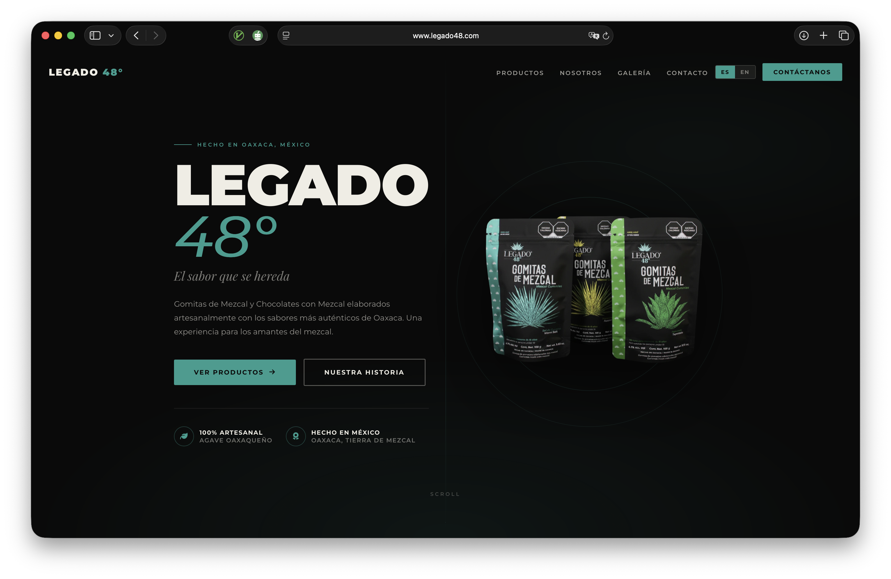

# LEGADO 48° — Landing Page

Official website for **LEGADO 48°**, an artisanal mezcal brand from Oaxaca, México. Handcrafted Mezcal Gummies and Mezcal Chocolates made with authentic Oaxacan flavors.

🌐 **Live site:** [legado48.com](https://legado48.com)



---

## Features

- **Mobile-first responsive design** — base styles for mobile, scaling up with `min-width` breakpoints
- **Bilingual (ES / EN)** — instant language toggle with no page reload
- **Lightbox gallery** — keyboard-navigable image viewer with prev/next and ESC support
- **Optimized images** — WebP with PNG fallback via `<picture>`, ~96% smaller than originals
- **Pre-filled order email** — mailto with structured form body, language-aware
- **Scroll reveal animations** — IntersectionObserver-based, no library dependency
- **SEO-ready** — JSON-LD structured data, canonical tag, OG social preview image, sitemap, robots.txt
- **PWA-ready** — Web App Manifest, service worker (cache-first assets, offline fallback), installable on Android/iOS
- **Vercel-configured** — cache headers for assets (1 year immutable), no-cache for HTML, SW, and manifest

---

## Tech Stack

Pure HTML + CSS + vanilla JS. No build step, no framework, no dependencies beyond CDN fonts and icons.

- **Google Fonts** — Montserrat + Playfair Display
- **Font Awesome 6** — icons
- **Vercel** — hosting and CDN

---

## Project Structure

```
legado48/
├── assets/
│   ├── css/main.css         # All styles (cached 1yr by Vercel CDN)
│   ├── js/main.js           # All scripts, defer (cached 1yr by Vercel CDN)
│   ├── icons/               # PWA app icons — 192/512 standard + maskable
│   └── images/              # Optimized WebP + PNG product images & OG preview
├── docs/                    # Brand documentation (not deployed to Vercel)
├── index.html               # Main page — HTML only, links CSS/JS externally
├── manifest.json            # PWA Web App Manifest
├── sw.js                    # Service Worker — cache-first assets, offline fallback
├── favicon.svg
├── robots.txt
├── sitemap.xml
├── vercel.json              # Cache headers and security headers
├── .vercelignore            # Excludes docs/, notes/, CLAUDE.md from deployment
└── .gitignore
```

---

## Local Development

No build step required — just open the file:

```bash
open index.html
```

Or serve it locally to test caching behavior:

```bash
npx serve .
```

---

## Deployment

Connected to Vercel via GitHub. Every push to `main` triggers an automatic deploy.

- `assets/` — cached for 1 year (immutable)
- `index.html` — always fresh (no-cache)
- `sw.js` and `manifest.json` — always fresh (no-cache)
- `docs/`, `notes/`, `CLAUDE.md` — excluded from deployment via `.vercelignore`

---

## Brand

| | |
|---|---|
| **Products** | Mezcal Gummies (Worm Salt, Tepextate, Passion Fruit) · Mezcal Chocolates |
| **Origin** | Oaxaca de Juárez, México |
| **Color palette** | `#0A0A0A` · `#2A9D8F` · `#F0EDE4` |
| **Instagram** | [@legado_48](https://www.instagram.com/legado_48) |
| **Facebook** | [@LEGADO48](https://www.facebook.com/LEGADO48/) |
| **Email** | ventaslegado48@gmail.com |
| **Phone** | 951 477 2122 |

---

## Developer

Built by **Juan Vásquez**

- 🌐 [juanvasquez.dev](https://www.juanvasquez.dev)
- 🔀 GitHub @JuanVqz

---

© 2026 LEGADO 48°. All rights reserved. See [LICENSE](LICENSE).
